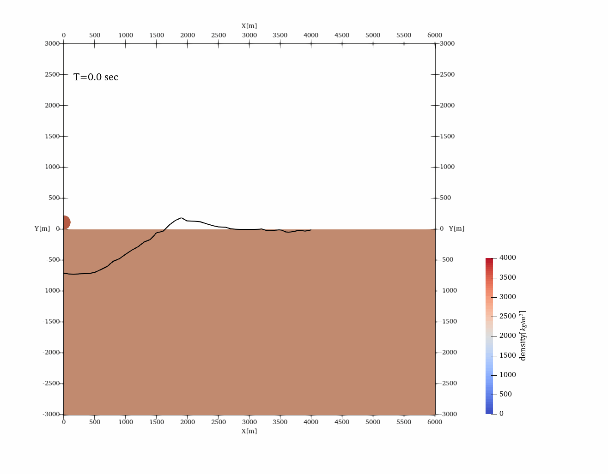
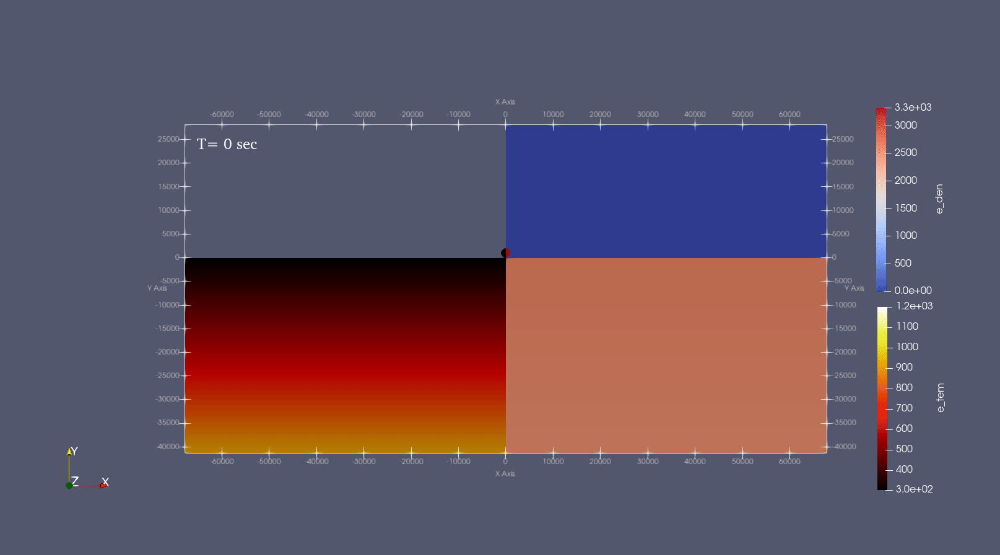

#### SALEc2d

SALEc2d is a 2d version of [SALEc](https://github.com/huachengli/SALEc-public) aimed to calculate the process of impact craters with higher resolution.

Features implemented in SALEc2d:

1. Parallelism/use MPI to accelerate the simulation.

2. Absorbing Boundary/Sponge boundary condition(SBC) and Perfect Match layers(PML) boundary have been implemented. The layers recommended for SBC and PML are 50 and 30 respectively.

3. Improved Stability.

#### Example

##### compare with iSALE2d
[Parallel numerical simulation of impact crater with perfect matched layers](https://arxiv.org/abs/2403.04267)
[iSALE-2D unexpected crashed condition](http://dx.doi.org/10.13140/RG.2.2.36277.45282)

https://github.com/user-attachments/assets/091f995c-a639-4d74-9f74-6d506548a688

left panel (x<0) is the result from iSALE2D and right panel(x>0) is the stable solution generated from SALEc2D

##### simple crater

[Analysis on the source position of Zhinyu crater ejecta](https://doi.org/10.1016/j.icarus.2025.116579)

[input](example/d112v110p05.inp)

Black line is the morphology of Zhinyu crater from SLDEM2015.

##### complex crater

[input](example/r1000v140b300e3.inp)

#### planet model

Utopia crater

[input](example/utopia.inp)

Author: 
    Li Huacheng, huacheng_li@pku.edu.cn
